# 技術スキルマップ

このドキュメントは、GitHub のプロジェクトから抽出した技術スキルセット、および https://main.flarebrow.com/ で公開されている実績をまとめたものです。

## 概要

総リポジトリ数: 83件
追加情報ソース:
- https://main.flarebrow.com/ (実績・運用サービス)

最終更新日: 2026-03-05

---

## 🎯 コアスキル

### プログラミング言語

#### スクリプト言語
- **Python** ⭐⭐⭐⭐⭐
  - 主要開発言語として多数のプロジェクトで使用
- **JavaScript** ⭐⭐⭐⭐⭐
  - フロントエンド・バックエンド両方で使用
- **TypeScript** ⭐⭐⭐⭐⭐
  - モダンなWebアプリ開発に使用
- **PHP** ⭐⭐⭐⭐⭐
  - Webアプリケーション開発

#### コンパイル言語
- **Kotlin** ⭐⭐⭐
  - Android開発
- **Java** ⭐⭐⭐⭐⭐
  - Android開発、バックエンドAPI、エンタープライズシステム
- **C#** ⭐⭐⭐⭐
  - Unity開発、ASP.NET
- **C/C++** ⭐⭐⭐
  - 組み込み・システムプログラミング
- **Swift** ⭐⭐
  - iOS開発
- **Objective-C** ⭐⭐
  - iOS開発（レガシー）

#### その他
- **Shell/Bash** ⭐⭐⭐⭐⭐
  - 自動化スクリプト、DevOps
- **Perl** ⭐⭐
  - バッチ処理、レガシーシステム
- **VBA** ⭐⭐⭐⭐
  - Excelマクロ、Office自動化
- **UWSC** ⭐⭐⭐
  - Windows自動化スクリプト
- **Ruby** ⭐
  - 小規模プロジェクト
- **Go** ⭐
  - テンプレート処理

---

## 🌐 Webフロントエンド

### フレームワーク・ライブラリ
- **Vue.js / Vue 3** ⭐⭐⭐⭐⭐
  - メインのフロントエンドフレームワーク
- **React** ⭐⭐⭐⭐
  - SPAアプリケーション開発
- **Next.js** ⭐⭐⭐
  - SSR/SSGアプリケーション
- **jQuery** ⭐⭐⭐⭐⭐
  - DOM操作、Ajax通信
  - レガシーWebアプリケーション

### スタイリング
- **CSS/CSS3** ⭐⭐⭐⭐
- **HTML/HTML5** ⭐⭐⭐⭐
- **SCSS/Sass** ⭐⭐⭐
- **Tailwind CSS** ⭐⭐⭐⭐
  - ユーティリティファーストCSS

### UI ライブラリ
- **NaiveUI** ⭐⭐⭐
  - Vue 3 UIコンポーネントライブラリ
- **Lucide Icons** ⭐⭐⭐⭐
  - アイコンライブラリ

### ブラウザ拡張機能
- **Chrome Extension API** ⭐⭐⭐⭐⭐

---

## ⚙️ バックエンド

### Webフレームワーク

#### Python
- **FastAPI** ⭐⭐⭐⭐⭐
  - モダンな非同期APIフレームワーク
- **Django** ⭐⭐⭐⭐⭐
  - フルスタックWebフレームワーク

#### PHP
- **Laravel** ⭐⭐⭐
  - モダンPHPフレームワーク
- **WordPress** ⭐⭐⭐
  - CMS開発

#### Node.js
- **Express.js** ⭐⭐⭐
  - Node.js Webフレームワーク
- **Next.js** ⭐⭐⭐
  - API Routes、Server Components、フルスタックReact

#### Java
- **Spring Boot** ⭐⭐⭐⭐⭐
  - RESTful API、マイクロサービス
- **Jakarta EE (Java EE)** ⭐⭐⭐⭐
  - エンタープライズアプリケーション

### API開発
- **RESTful API** ⭐⭐⭐⭐⭐
- **WebSocket** ⭐⭐⭐
- **Webhook** ⭐⭐⭐

### Webサーバー
- **Apache** ⭐⭐⭐⭐⭐
  - HTTPサーバー、.htaccess設定
- **Nginx** ⭐⭐⭐⭐⭐
  - 高性能Webサーバー、リバースプロキシ
- **Node.js HTTP Server** ⭐⭐⭐
  - JavaScriptベースのWebサーバー

---

## 💾 データベース・ストレージ

### RDBMS
- **PostgreSQL** ⭐⭐⭐⭐⭐
  - メインデータベース
- **MySQL/MariaDB** ⭐⭐⭐⭐⭐
- **SQL Server** ⭐⭐⭐⭐⭐
  - Microsoft RDBMS
- **SQLite** ⭐⭐⭐⭐⭐
  - 軽量データベース

### ORM
- **SQLAlchemy** ⭐⭐⭐⭐⭐
  - Python ORM
- **Alembic** ⭐⭐⭐⭐⭐
  - データベースマイグレーション

### NoSQL・キャッシュ
- **Redis** ⭐⭐⭐
  - インメモリデータストア、キャッシュ

---

## ☁️ クラウド・インフラ

### クラウドプラットフォーム
- **AWS** ⭐⭐⭐
  - EC2, S3, Lambda, RDS
- **Azure** ⭐⭐⭐⭐⭐
  - Azure Functions, Azure Cognitive Services
- **Google Cloud Platform** ⭐⭐⭐
- **Cloudflare** ⭐⭐⭐⭐
  - CDN, Workers, AI Gateway

### IaC (Infrastructure as Code)
- **Terraform** ⭐⭐⭐⭐⭐
  - インフラ管理の主要ツール
- **Bicep** ⭐⭐⭐
  - Azure IaC

### コンテナ・仮想化
- **Docker** ⭐⭐⭐⭐⭐
  - コンテナ化の主要技術
  - ほぼすべてのプロジェクトで使用
- **Docker Compose** ⭐⭐⭐⭐⭐
  - マルチコンテナアプリケーション管理

---

## 📱 モバイル開発

### Android
- **Kotlin** ⭐⭐⭐
  - モダンAndroid開発
- **Java** ⭐⭐⭐
  - Android開発（レガシー）

### iOS
- **Swift** ⭐⭐
  - iOS開発
- **Objective-C** ⭐⭐
  - iOS開発（レガシー）

### クロスプラットフォーム
- **PWA (Progressive Web Apps)** ⭐⭐⭐⭐⭐

---

## 🤖 AI・機械学習

### AI フレームワーク・サービス
- **Stable Diffusion** ⭐⭐⭐⭐
  - 画像生成AI
- **Dify** ⭐⭐⭐⭐
  - AIアプリケーション開発プラットフォーム
- **Azure Cognitive Services** ⭐⭐⭐
  - Speech-to-Text, Text-to-Speech
- **Claude API (Anthropic)** ⭐⭐⭐⭐⭐
  - 大規模言語モデルAPI
- **OpenAI API** ⭐⭐⭐⭐
  - GPT モデル

### LLM Applications
- **RAG (Retrieval-Augmented Generation)** ⭐⭐⭐
  - ベクトルDB統合、コンテキスト拡張
- **Prompt Engineering** ⭐⭐⭐⭐⭐
  - プロンプト設計、最適化
- **Tool Calling** ⭐⭐⭐⭐
  - 関数呼び出し、API統合
- **Agent Architecture** ⭐⭐⭐⭐
  - AIエージェント設計、実装
- **MCP (Model Context Protocol)** ⭐⭐⭐⭐⭐
  - MCP Server実装

---

## 🎮 ゲーム開発

### ゲームエンジン
- **Unity** ⭐⭐⭐
  - 3Dゲーム開発
- **Unreal Engine** ⭐⭐
  - 高品質3Dゲーム開発
  - リアルタイムレンダリング

---

## 🎨 クリエイティブツール

### Adobe Creative Cloud
- **Adobe Premiere Pro** ⭐⭐⭐
  - 動画編集
- **Adobe After Effects** ⭐⭐⭐
  - モーショングラフィックス、VFX
- **Adobe Photoshop** ⭐⭐⭐⭐
  - 画像編集、デザイン
- **Adobe Illustrator** ⭐⭐⭐
  - ベクターグラフィックス、ロゴデザイン
- **Adobe Audition** ⭐⭐⭐
  - オーディオ編集

---

## 🔧 開発ツール・環境

### バージョン管理
- **Git** ⭐⭐⭐⭐⭐
- **GitHub** ⭐⭐⭐⭐⭐
  - リポジトリ管理、CI/CD

### CI/CD
- **GitHub Actions** ⭐⭐⭐⭐⭐
- **Jenkins** ⭐⭐⭐⭐
  - 自動ビルド・デプロイ
  - 継続的インテグレーション
- **pre-commit** ⭐⭐⭐⭐
  - コードの自動チェック

### 開発環境
- **VS Code** ⭐⭐⭐⭐⭐
  - メインエディタ
- **Android Studio** ⭐⭐⭐⭐
  - Android開発統合環境
  - バージョン 1.4〜4.1.3 使用経験
- **Xcode** ⭐⭐⭐
  - iOS/macOS開発統合環境
- **DevContainer** ⭐⭐⭐⭐⭐
  - 統一された開発環境

### コード品質管理
- **Ruff** ⭐⭐⭐⭐⭐
  - Python linter/formatter
- **mypy** ⭐⭐⭐⭐⭐
  - Python 型チェック
- **ESLint** ⭐⭐⭐⭐
  - JavaScript/TypeScript linter
- **Prettier** ⭐⭐⭐⭐
  - コードフォーマッター

### テスティング
- **pytest** ⭐⭐⭐⭐
  - Python テストフレームワーク
- **Playwright** ⭐⭐⭐
  - E2Eテスト

### DevOps
- **Infrastructure as Code (IaC)** ⭐⭐⭐⭐⭐
  - Terraform、Bicep による自動化
- **Immutable Infrastructure** ⭐⭐⭐⭐
  - コンテナベースの不変インフラ
- **GitOps** ⭐⭐⭐⭐⭐
  - Git を使ったインフラ管理
- **CI/CD Pipeline Design** ⭐⭐⭐⭐⭐
  - 継続的インテグレーション・デリバリー設計
- **Zero-downtime Deployment** ⭐⭐⭐⭐
  - ブルーグリーンデプロイ、カナリアリリース

---

## 🏠 IoT・組み込み

### IoT デバイス
- **OMRON センサー** ⭐⭐⭐⭐⭐
  - 環境センサー
- **Broadlink** ⭐⭐⭐⭐⭐
  - スマートホームデバイス
- **SwitchBot** ⭐⭐⭐⭐⭐
  - スマートホームデバイス

### 組み込み開発
- **Raspberry Pi** ⭐⭐⭐⭐⭐
- **Arduino** ⭐⭐

---

## 🔐 セキュリティ

### 認証・認可

#### 認証技術
- **JWT (JSON Web Token)** ⭐⭐⭐⭐⭐
  - HS256署名アルゴリズム
  - アクセストークン・リフレッシュトークン管理
  - トークンローテーション
- **OAuth 2.0** ⭐⭐⭐⭐
  - ソーシャルログイン実装
- **HttpOnly Cookie認証** ⭐⭐⭐⭐
  - XSS耐性向上
  - SameSite属性設定
- **メール認証（ワンタイムトークン）** ⭐⭐⭐⭐
  - 暗号学的に安全なトークン生成
  - 24時間有効期限、使用後自動無効化
- **API Key管理** ⭐⭐⭐⭐
  - `secrets.token_urlsafe(32)` による256bit生成

#### 認可・アクセス制御
- **RBAC (ロールベースアクセス制御)** ⭐⭐⭐⭐⭐
  - 階層的ロール管理
  - エンドポイント別権限設定
  - セキュアデフォルト（未定義パスは拒否）
  - ユーザー切り替え機能
- **データレベルアクセス制御** ⭐⭐⭐⭐
  - リソースレベルの権限管理

#### セッション管理
- **Redisベースのトークンホワイトリスト** ⭐⭐⭐⭐⭐
  - fail-closed方式（安全側に倒す設計）
  - 同時セッション数制限（FIFO）
  - 即時セッション無効化
  - TTL自動管理
- **分散ロック** ⭐⭐⭐⭐
  - Redis Luaスクリプト
  - マルチインスタンス対応
  - デッドロック防止

### 暗号化・ハッシュ化

- **bcrypt** ⭐⭐⭐⭐⭐
  - パスワードハッシュ化（rounds=12）
  - pwdlib使用
- **HMAC-SHA256** ⭐⭐⭐⭐
  - CSRFトークン署名
  - タイミング攻撃対策（定時間比較）
- **AES-256** ⭐⭐⭐⭐
  - TDE (Transparent Data Encryption)
  - データベース保存時暗号化
- **TLS 1.2+** ⭐⭐⭐⭐⭐
  - 転送時暗号化
  - HTTPS強制

### セキュリティヘッダー・ミドルウェア

#### セキュリティヘッダー
- **HSTS (Strict-Transport-Security)** ⭐⭐⭐⭐⭐
  - 1年間 + サブドメイン + プリロード
- **CSP (Content Security Policy)** ⭐⭐⭐⭐⭐
  - 環境別・API種別別の動的生成
  - frame-ancestors制御
  - upgrade-insecure-requests
- **X-Frame-Options** ⭐⭐⭐⭐
  - クリックジャッキング防止
- **X-Content-Type-Options** ⭐⭐⭐⭐
  - MIMEスニッフィング防止
- **X-XSS-Protection** ⭐⭐⭐
- **Referrer-Policy** ⭐⭐⭐⭐
- **Expect-CT** ⭐⭐⭐
  - Certificate Transparency強制

#### ミドルウェア
- **TrustedHostMiddleware** ⭐⭐⭐⭐
  - ホストホワイトリスト検証
- **SecurityHeadersMiddleware** ⭐⭐⭐⭐⭐
  - Azure WAF統合
  - 環境適応型ヘッダー設定
- **AuthMiddleware** ⭐⭐⭐⭐⭐
  - JWT認証・RBAC認可
  - 柔軟なパス除外（正規表現・Glob・プレフィックス）
- **CSRFMiddleware** ⭐⭐⭐⭐
  - Cookie認証時のCSRF保護
  - X-CSRF-Tokenヘッダー検証
- **RateLimitMiddleware** ⭐⭐⭐⭐
  - Redis Luaスクリプトによるアトミック制御
- **AuditLogMiddleware** ⭐⭐⭐⭐⭐
  - 監査ログ記録
  - 機密情報自動マスキング
- **LoggingMiddleware** ⭐⭐⭐⭐
  - 構造化アクセスログ

### 攻撃対策

#### レート制限・ブルートフォース対策
- **Redis Luaスクリプトレート制限** ⭐⭐⭐⭐⭐
  - アトミックカウンター管理
  - エンドポイント別制限設定
  - IPベースブロック（15分間）
  - fail-open設計（Redis障害時は許可）
- **ブルートフォース攻撃検知** ⭐⭐⭐⭐
  - ログイン試行監視
  - 5回連続失敗でアラート
- **DDoS Protection** ⭐⭐⭐
  - Azure統合

#### 脆弱性対策
- **SQLインジェクション対策** ⭐⭐⭐⭐⭐
  - SQLAlchemy ORM使用
  - パラメータバインディング
  - テーブル名ホワイトリスト
- **XSS対策** ⭐⭐⭐⭐⭐
  - HttpOnly Cookie
  - CSP適用
  - 入力サニタイズ
- **CSRF対策** ⭐⭐⭐⭐⭐
  - CSRFトークン（HMAC-SHA256署名）
  - タイムスタンプ検証（1時間有効）
  - セッションID紐付き
- **SSRF対策** ⭐⭐⭐⭐
  - Sentryトンネルのホストホワイトリスト
  - 許可ホストサフィックス制限
- **Command Injection対策** ⭐⭐⭐⭐
  - Bandit静的解析
  - 入力バリデーション

#### 入力検証
- **Pydantic バリデーション** ⭐⭐⭐⭐⭐
  - 全APIエンドポイントで必須化
  - 詳細エラーメッセージ（日本語化）
  - URLフォーマット検証

### セキュリティ監査・ロギング

- **監査ログ** ⭐⭐⭐⭐⭐
  - 二重記録（PostgreSQL + Application Insights）
  - 変更前後の値記録
  - 機密情報自動マスキング
  - フォールバック機構
- **構造化アクセスログ** ⭐⭐⭐⭐
  - JSON形式
  - WAF対応クライアントIP抽出
  - 日次ローテーション
- **セッション管理画面** ⭐⭐⭐⭐
  - アクティブセッション可視化
  - 個別・一括無効化
  - IP・ブラウザ・TTL表示

### コード品質・静的解析

- **Bandit** ⭐⭐⭐⭐⭐
  - Pythonセキュリティ静的解析
  - SQLi, Command Injection, ハードコード秘密鍵検出
  - medium以上でCI/CD失敗
- **pip-audit** ⭐⭐⭐⭐⭐
  - Python依存パッケージ脆弱性スキャン
  - CVE自動検出
- **eslint-plugin-security** ⭐⭐⭐⭐
  - JavaScriptセキュリティパターン検出
- **SonarQube** ⭐⭐⭐⭐⭐
  - 総合的コード品質・セキュリティ分析
  - 信頼性・セキュリティ・保守性評価
  - 重複コード検出

### ネットワークセキュリティ

- **SSL/TLS証明書管理** ⭐⭐⭐⭐
  - Let's Encrypt, Certbot
- **DNS管理** ⭐⭐⭐⭐
- **Bind9** ⭐⭐⭐⭐⭐
  - DNSサーバー構築・運用
- **WAF (Web Application Firewall)** ⭐⭐⭐⭐⭐
  - DOS/XSS対策
  - OWASP Top 10対策
  - Azure WAF統合
  - 地理的制限

### インフラセキュリティ

#### Azure セキュリティ
- **VNet (Virtual Network)** ⭐⭐⭐⭐
  - ネットワーク分離（アプリ/DB/キャッシュ/管理サブネット）
  - Private Endpoints
- **NSG (Network Security Groups)** ⭐⭐⭐⭐
  - ポート制限
  - インバウンド制御
- **Azure Key Vault** ⭐⭐⭐⭐⭐
  - シークレット管理
  - Managed Identity認証
  - 自動ローテーション
  - VNet統合
- **Azure Application Gateway** ⭐⭐⭐
  - リバースプロキシ
  - SSL終端
- **Azure Security Center** ⭐⭐⭐
  - セキュリティ監視
  - コンプライアンス管理
- **Private Endpoints** ⭐⭐⭐⭐
  - PostgreSQL, Redis, Key Vaultへのプライベート接続
  - パブリックインターネット遮断

#### 監視・可観測性
- **Application Insights** ⭐⭐⭐⭐⭐
  - OpenTelemetry統合
  - 自動計装（FastAPI, SQLAlchemy, Redis, Requests）
  - カスタムスパン・メトリクス
- **OpenTelemetry** ⭐⭐⭐⭐
  - 分散トレーシング
  - 計装ライブラリ
- **Sentry** ⭐⭐⭐⭐
  - エラートラッキング
  - before_sendフィルタリング
  - 機密情報除去
  - Sentryトンネル（DSN隠蔽 + SSRF防止）

---

## 🎨 その他の専門領域

### Bot 開発
- **Discord.py** ⭐⭐⭐⭐⭐
  - Discord Bot開発
- **LINE Bot API** ⭐⭐⭐⭐
  - LINE Messaging API
  - チャットボット開発

### メールシステム
- **Mailcow** ⭐⭐⭐⭐⭐
  - メールサーバー管理
- **Postfix** ⭐⭐⭐⭐⭐
- **Dovecot** ⭐⭐⭐⭐⭐

### バックエンドサービス
- **Firebase** ⭐⭐⭐⭐⭐
  - リアルタイムデータベース
  - 認証、ストレージ、プッシュ通知

### データ分析
- **Web Scraping** ⭐⭐⭐
- **PDF生成** ⭐⭐⭐

---

## 🏆 実績・運用サービス

### 公開サービス・プロダクト

#### Pythonパッケージ
- **flaretool**
  - PyPIで公開中
  - **40,000+ インストール**
  - 祝日・営業日判定機能など便利ツール集
  - パッケージURL: https://pypi.org/project/flaretool/

#### モバイルアプリケーション
- **WiFiルーター情報取得アプリ**
  - **約4,000人のインストール実績**
  - LTE接続情報の自動取得
- **Androidアプリ群**
  - **30+個のアプリを開発・公開**
  - 学内システム連携アプリ（時間割・シラバス自動取得）

#### Webサービス
- **短縮URLサービス** (https://fbs.ms)
  - 独自実装の短縮URLサービス
  - Web版・Windowsアプリ版を提供
  - 現在運用中
- **WebAPI各種**
  - QRコード生成API
  - DDNS機能
  - ヤマト運輸追跡API
- **AdHost（危険なホストリスト）**
  - セキュリティ情報の公開
  - URL: https://fbs.ms/adhostlist

#### デスクトップアプリケーション
- **商品管理システム** (Windows)
  - 在庫管理、売上管理機能

### 運用中のインフラ

#### サーバー運用
- **10台のサーバーを運用管理**
  - 稼働中: 2台
  - 休止中: 8台（適宜起動）

#### 提供サービス
- **メールサーバー**
  - Mailcow使用
  - 24時間稼働
- **Proxyサーバー**
  - 2台構成で運用
- **短縮URLサービス**
  - 高可用性構成

### IoT・組み込みプロジェクト
- **家電操作システム**
  - Raspberry Pi + 赤外線センサー
  - スマートホーム実装
- **LEDマトリクスディスプレイ**
  - 時刻・気象・温湿度表示
  - リアルタイム情報表示システム

### 技術的特徴
- 自動ビルド/デプロイパイプライン構築
- 独自バージョン管理機能実装
- Webスクレイピング技術活用
- Push通知システム実装
- DOS/XSS対策・WAF導入

---

## 📊 スキル統計

### 言語別プロジェクト数
1. Python: 45+ プロジェクト
2. JavaScript: 30+ プロジェクト
3. TypeScript: 15+ プロジェクト
4. PHP: 10+ プロジェクト
5. Shell: 10+ プロジェクト

### 主要技術スタック組み合わせ

#### パターン1: モダンWebアプリケーション
```
Vue 3 + TypeScript + FastAPI + PostgreSQL + Docker + Terraform
```

#### パターン2: フルスタックPython
```
Django + PostgreSQL + Docker + HTML/CSS/JavaScript
```

#### パターン3: AI統合アプリケーション
```
Python + FastAPI + AI API (Claude/OpenAI) + Docker
```

#### パターン4: IoTシステム
```
Python + MQTT + センサーデバイス + Docker
```

---

## 📈 スキルレベル定義

- ⭐⭐⭐⭐⭐: エキスパート（複数の大規模プロジェクトで実践経験）
- ⭐⭐⭐⭐: 上級（複数プロジェクトで実践経験）
- ⭐⭐⭐: 中級（いくつかのプロジェクトで使用経験）
- ⭐⭐: 初級（少数のプロジェクトで使用経験）
- ⭐: 基礎（学習中または小規模な使用経験）

---

## 📝 注意事項

このスキルマップは、GitHubリポジトリの言語統計と説明から自動抽出されています。
実際のスキルレベルは、プロジェクトの規模、複雑さ、役割によって異なる場合があります。

---

## 📊 Mermaid 図による可視化

### 全体スキルマップ（マインドマップ）

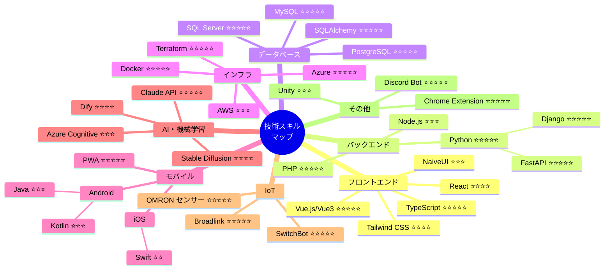

### 技術スタック組み合わせパターン

```mermaid
graph TB
    subgraph Pattern1[パターン1: モダンWebアプリケーション]
        P1_FE[Vue 3 + TypeScript]
        P1_BE[FastAPI]
        P1_DB[PostgreSQL]
        P1_INF[Docker + Terraform]

        P1_FE --> P1_BE
        P1_BE --> P1_DB
        P1_BE --> P1_INF
        P1_DB --> P1_INF
    end

    subgraph Pattern2[パターン2: フルスタックPython]
        P2_BE[Django]
        P2_FE[HTML/CSS/JS]
        P2_DB[PostgreSQL]
        P2_INF[Docker]

        P2_FE --> P2_BE
        P2_BE --> P2_DB
        P2_BE --> P2_INF
        P2_DB --> P2_INF
    end

    subgraph Pattern3[パターン3: AI統合アプリケーション]
        P3_BE[Python + FastAPI]
        P3_AI[Claude API / OpenAI]
        P3_INF[Docker]

        P3_BE --> P3_AI
        P3_BE --> P3_INF
    end

    subgraph Pattern4[パターン4: IoTシステム]
        P4_BE[Python]
        P4_IOT[センサーデバイス]
        P4_MQTT[MQTT]
        P4_INF[Docker]

        P4_BE --> P4_MQTT
        P4_MQTT --> P4_IOT
        P4_BE --> P4_INF
    end

    style Pattern1 fill:#e1f5ff
    style Pattern2 fill:#fff9e1
    style Pattern3 fill:#ffe1f5
    style Pattern4 fill:#e1ffe1
```

### フロントエンド技術スタック

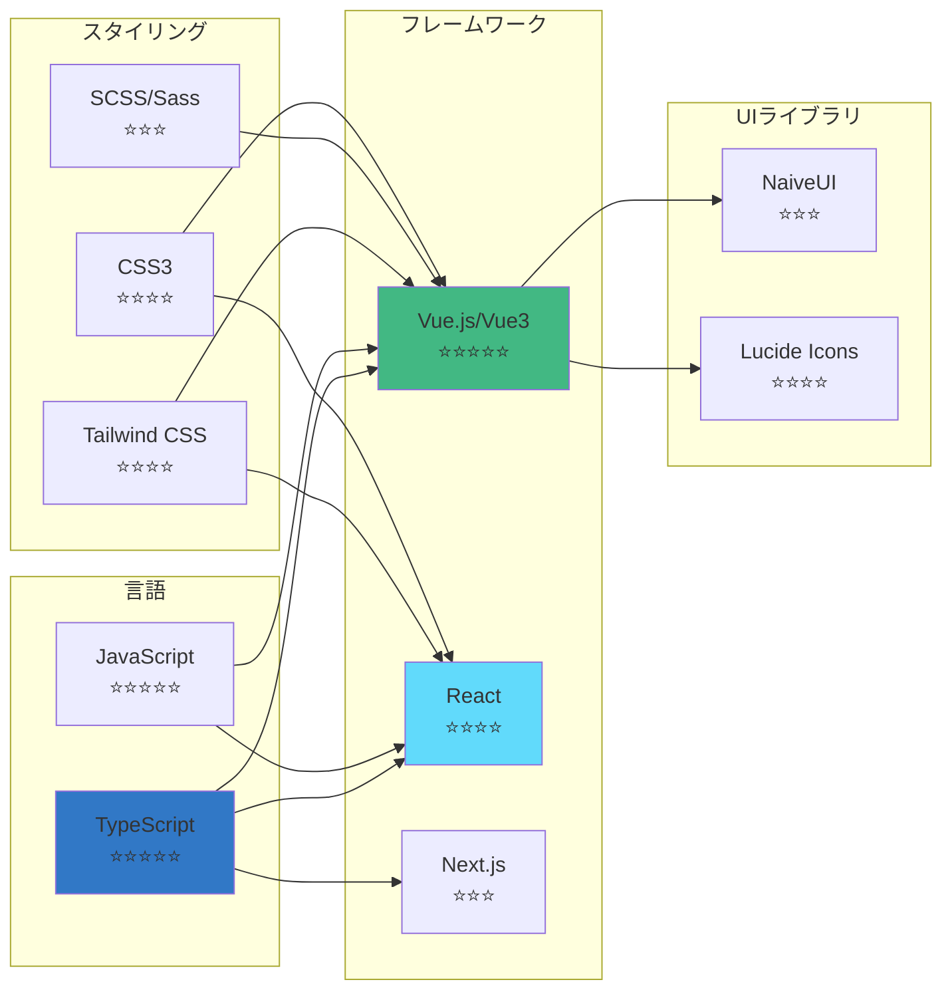

### バックエンド技術スタック

```mermaid
graph TB
    subgraph Python[Python エコシステム ⭐⭐⭐⭐⭐]
        FastAPI[FastAPI<br/>⭐⭐⭐⭐⭐]
        Django[Django<br/>⭐⭐⭐⭐⭐]
        SQLAlchemy[SQLAlchemy<br/>⭐⭐⭐⭐⭐]
        Alembic[Alembic<br/>⭐⭐⭐⭐⭐]
    end

    subgraph PHP[PHP エコシステム ⭐⭐⭐⭐⭐]
        Laravel[Laravel<br/>⭐⭐⭐]
        WordPress[WordPress<br/>⭐⭐⭐]
    end

    subgraph NodeJS[Node.js エコシステム ⭐⭐⭐]
        Express[Express.js<br/>⭐⭐⭐]
        NextJS[Next.js<br/>⭐⭐⭐]
    end

    subgraph Java[Java エコシステム ⭐⭐⭐⭐⭐]
        SpringBoot[Spring Boot<br/>⭐⭐⭐⭐⭐]
        JakartaEE[Jakarta EE<br/>⭐⭐⭐⭐]
    end

    subgraph Database[データベース]
        PostgreSQL[(PostgreSQL<br/>⭐⭐⭐⭐⭐)]
        MySQL[(MySQL/MariaDB<br/>⭐⭐⭐⭐⭐)]
        SQLServer[(SQL Server<br/>⭐⭐⭐⭐⭐)]
        SQLite[(SQLite<br/>⭐⭐⭐⭐⭐)]
    end

    FastAPI --> SQLAlchemy
    SQLAlchemy --> PostgreSQL
    SQLAlchemy --> MySQL
    Django --> PostgreSQL
    Django --> MySQL
    Laravel --> MySQL
    Express --> PostgreSQL
    NextJS --> PostgreSQL
    SpringBoot --> PostgreSQL
    SpringBoot --> MySQL

    SQLAlchemy --> Alembic

    style FastAPI fill:#009688
    style Django fill:#092e20
    style PostgreSQL fill:#336791
    style SpringBoot fill:#6db33f
```

### バックエンド技術ツリー構造

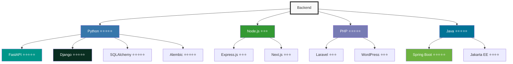

### インフラ・DevOps スタック

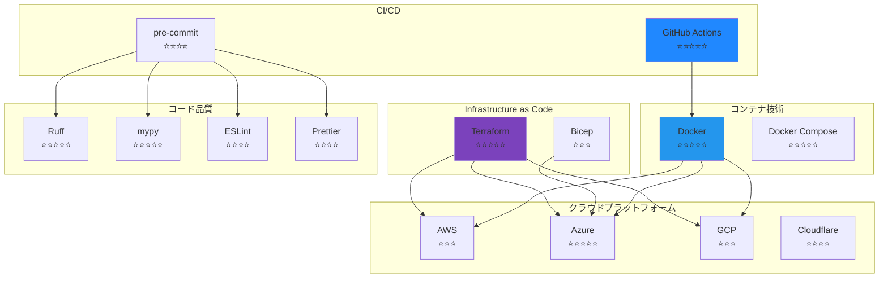

### モバイル開発スタック

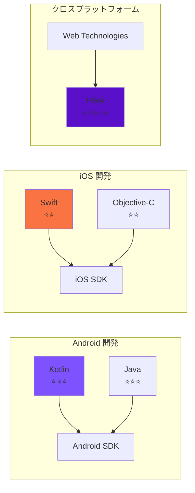

### AI・機械学習スタック

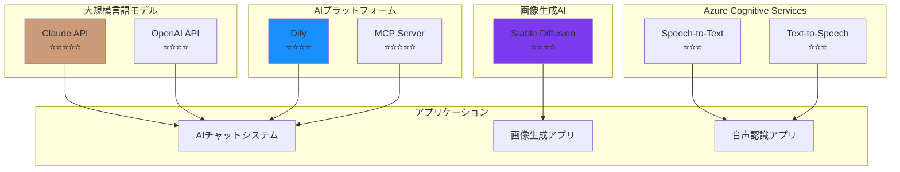

### 言語別プロジェクト分布

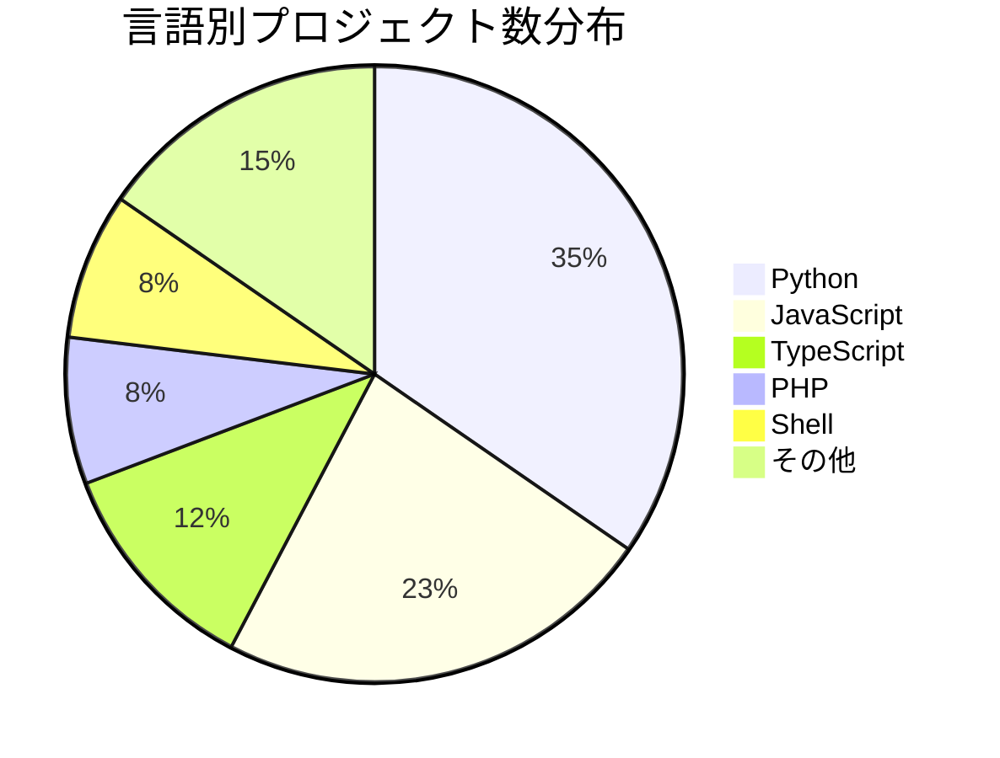

### スキルレベル分布

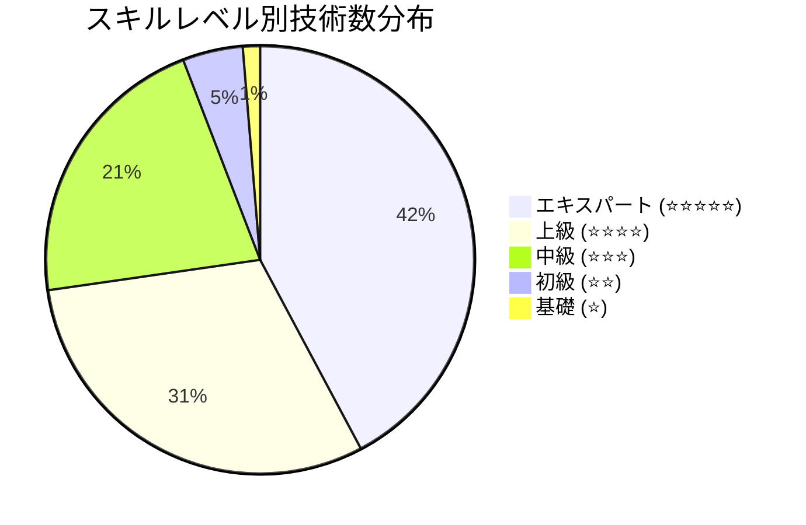

### 領域別スキル分布

```mermaid
graph TB
    Skills[技術スキル総覧]

    Skills --> Frontend[フロントエンド<br/>15+ 技術]
    Skills --> Backend[バックエンド<br/>20+ 技術]
    Skills --> Database[データベース<br/>5+ 技術]
    Skills --> Cloud[クラウド・インフラ<br/>10+ 技術]
    Skills --> Mobile[モバイル開発<br/>6+ 技術]
    Skills --> AI[AI・機械学習<br/>8+ 技術]
    Skills --> DevOps[DevOps<br/>12+ 技術]
    Skills --> IoT[IoT・組み込み<br/>5+ 技術]
    Skills --> Other[その他<br/>10+ 技術]

    Frontend --> FE_Vue[Vue.js]
    Frontend --> FE_React[React]
    Frontend --> FE_TS[TypeScript]

    Backend --> BE_Python[Python/FastAPI]
    Backend --> BE_Django[Django]
    Backend --> BE_PHP[PHP/Laravel]

    Cloud --> C_AWS[AWS]
    Cloud --> C_Azure[Azure]
    Cloud --> C_Docker[Docker]
    Cloud --> C_Terraform[Terraform]

    Mobile --> M_Android[Android/Kotlin]
    Mobile --> M_iOS[iOS/Swift]
    Mobile --> M_PWA[PWA]

    AI --> AI_Claude[Claude API]
    AI --> AI_SD[Stable Diffusion]
    AI --> AI_Dify[Dify]

    style Frontend fill:#e1f5ff
    style Backend fill:#fff9e1
    style Database fill:#ffe1f5
    style Cloud fill:#e1ffe1
    style Mobile fill:#ffe1e1
    style AI fill:#e1e1ff
    style DevOps fill:#f5e1ff
    style IoT fill:#e1fff5
    style Other fill:#f5f5e1
```

### 開発プロセス全体図

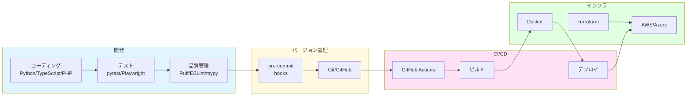

---

生成日時: 2026-03-05
データソース: GitHub
