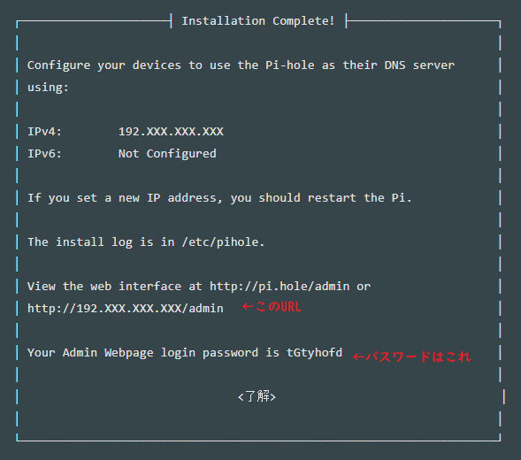

<!-- TOC -->

- [1. はじめに](#1-はじめに)
- [2. DNSとは](#2-dnsとは)
- [3. 広告ブロックの仕組み](#3-広告ブロックの仕組み)
- [4. pi-holeとは](#4-pi-holeとは)
- [5. インストール方法](#5-インストール方法)
    - [5.1. 準備物](#51-準備物)
    - [5.2. インストール](#52-インストール)
    - [5.2. DNSサーバー設定](#52-dnsサーバー設定)
        - [Windowsの場合](#windowsの場合)
        - [iPhoneの場合](#iphoneの場合)
- [2. おまけ](#2-おまけ)
    - [2.1. ローカルのすべての端末に適応させる方法！](#21-ローカルのすべての端末に適応させる方法)

<!-- /TOC -->

# 1. はじめに
この記事ではDNSサーバーを用いた広告や危険なサイトへのブロックを行う方法について解説しています。
※広告をブロックするためのホストリストは[こちらのAdhost](https://github.com/flarebrow/public)を使用しています。

# 2. DNSとは

DNSとは`IPアドレスとドメイン名の対応を管理（ドメイン↔IPアドレス の相互変換）する仕組み`のことです。
実はこの仕組は身近なスマホやPCで使われています！  
例えばブラウザ等でサイトを開いた時に、コンピュータ内部ではDNSを用いてURLをコンピュータにとって分かりやすいIPアドレスに変換しています。それによって場所を特定してアクセスをすることで、サイトの閲覧を可能にしています！

電話帳で例えると..
URL ▶ 名前
IPアドレス ▶ 住所や電話番号
に該当します！

# 3. 広告ブロックの仕組み

例えば広告のURLを `https://広告のドメイン.com` とすると通常はDNSサーバーが正しいIPアドレスを返してくれるので、広告がそのまま表示されます。

# 4. pi-holeとは

ソフトウェアやブラウザの拡張機能を入れことなく、クライアントの DNS 設定を変更するだけで Web 広告やトラッキングを防ぐ事が可能な、DNS ベースの広告ブロック DNS サーバーです。

# 5. インストール方法

## 5.1. 準備物
* IPアドレスを固定化したラズパイ（なければ仮想環境でもOK）のみ！  
* 自由な時間(笑)
※IPアドレスを固定化する方法はこの記事では割愛します。

## 5.2.  インストール

※すべてのコマンドは管理者権限が必要です。

①以下のコマンドを実行すると自動でインストールが始まります。
```Bash:公式サイトからインストール
curl -sSL https://install.pi-hole.net | sudo bash
```
または
```Bash:公式サイトからインストール+ブロックリスト自動追加（③番のコマンドが不要になります）
curl -sSL https://raw.githubusercontent.com/flarebrow/public/master/tools/pi-hole/pihole_install.sh | sudo bash
```

■オプションの説明
>-s, --silent
>silentモード （コンソールに何も出力されない）
>-S, --show-error
>--silentの時にエラーが起きた場合はその内容が表示される
>-L, --location
>サーバーの移動があった（レスポンスコード3XX）の場合は新しいサーバーに再びcurlしてくれます

②実行すると以下のような説明が表示されるので次の通りに実行してください。
>① This installer will transform your device into a network-wide ad blocker 
>->了解
>
>② The Pi-hole is free, but powered by your donations:http://pi-hole.net/donate
>->了解
>
>③ The Pi-hole is a SERVER so it needs a STATIC IP ADDRESS to ....
>->了解
>
>④ Choose An Interface (press space to select) 
>(\*) eth0   available　<font color="red">有線LANを使用している場合はこちらをチェック！</font>
>( ) wlan0  available　<font color="red">wifiを使用している場合はこちらをチェック！</font>
>->了解
>
>⑤ Select Upstream DNS Provider. To use your own, select Custom.
>Google (ECS)　←<font color="blue">選択</font>
>OpenDNS (ECS)
>...
>->了解
>
>⑥ Pi-hole relies on third party lists in order to block ads. <font color="red">すべてのチェックを外してください</font>
>[] StevenBlack  StevenBlack's Unified Hosts List 
>[] MalwareDom   MalwareDomains 
>...
>->了解
>
>⑦ Select Protocols (press space to select)
>[\*] IPv4  Block ads over IPv4 <font color="blue">基本的にはこちらのみでOKです</font>
>[] IPv6  Block ads over IPv6 <font color="blue">IPv6を使用する場合はこちらもチェック！</font>
>->了解
>
>⑧ Do you want to use your current network settings as a static address?
>->はい
>
>⑨ It is possible your router could still....
>->了解
>
>⑩ Do you wish to install the web admin interface? <font color="blue">Web上でpi-holeの管理ができます。</font>
>(\*) On(Recommended) 
>() Off <font color="blue">必要がない場合はこちらをチェック！</font>
>->了解
>
>⑪ Do you wish to install the web server (lighttpd)?<font color="blue">Web上で管理をするためのミドルウェアのインストールです。</font>
>(\*) On(Recommended)
>() Off <font color="blue">既にApacheがインストールされている場合はこちらをチェック！</font>
>->了解
>
>⑫ Do you want to log queries?
>(\*) On(Recommended)
>() Off
>->了解
>
>⑬ Select a privacy mode for FTL
>(\*) 0 Show everything
>()  1 Hide domains
>...
>->了解

これでインストールは完了です！

③広告ホストリスト登録

こちらのコマンドを実行することで、広告ブロックするためのホストを登録することができます。

```Bash:広告リスト追加
echo 'https://raw.githubusercontent.com/flarebrow/public/master/Adhost/hosts' | sudo tee -a /etc/pihole/adlists.list
sudo pihole -g
```
これでpi-holeの設定は完了です！

>補足！
>インストール後の以下のURLにアクセスするとWeb管理画面へアクセスできます！



## 5.2.  DNSサーバー設定

### Windowsの場合

1. 左下のWindowsマークより「設定」をクリックします。

2. 「ネットワークとインターネット」をクリックします。

3. 「アダプターのオプションを変更する」をクリックします。

4. インターネット接続のアイコンを右クリックして、プロパティをクリックします。（添付はWi-Fiでインターネット接続している状態です）

※有線LANでインターネット接続している場合は、イーサネットのアイコンのプロパティをクリックします。

5. 「インターネットプロトコルバージョン4（TCP/IPv4）を選択して「プロパティ」をクリックします

6. 「次のDNSサーバーのアドレスを使う」にチェックを入れて優先DNSサーバーに8.8.8.8、代替DNSサーバーに8.8.4.4を入力して「OK」をクリックします。


広告ブロック完了！！

### iPhoneの場合

設定＞Wi-Fi＞接続中のWiFi設定（！マーク）＞DNSを構成＞手動を選択！

→すでに登録されているIPアドレスを削除

→サーバーを追加

→ラズパイのIPアドレスを入力
広告ブロック完了！！

# 2. おまけ

## 2.1. ローカルのすべての端末に適応させる方法！

ルーターの設定でDNSサーバーをラズパイのIPアドレスにするとすべての端末で広告を消すことができます！

[Aterm製ルーターの設定方法](https://www.aterm.jp/function/wg2600hp3/guide/namesaver.html)

BUFFALO製のルーターの設定箇所

